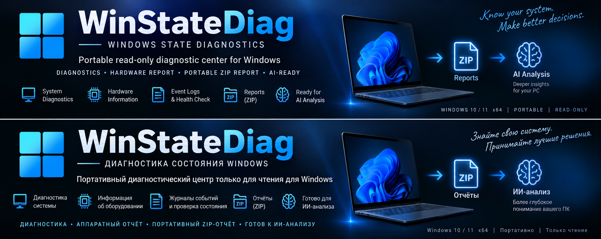
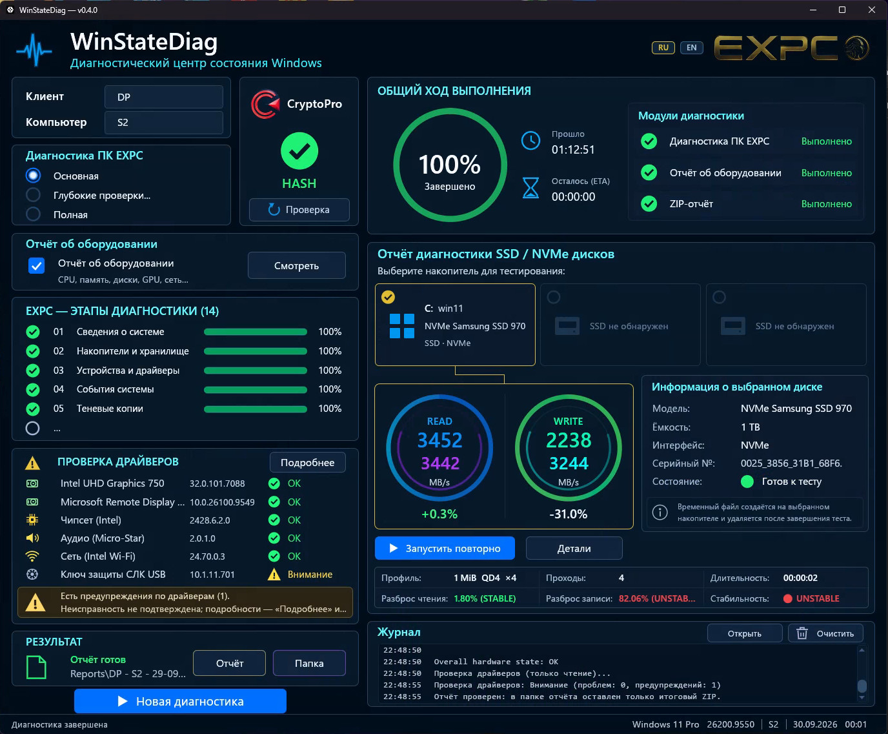
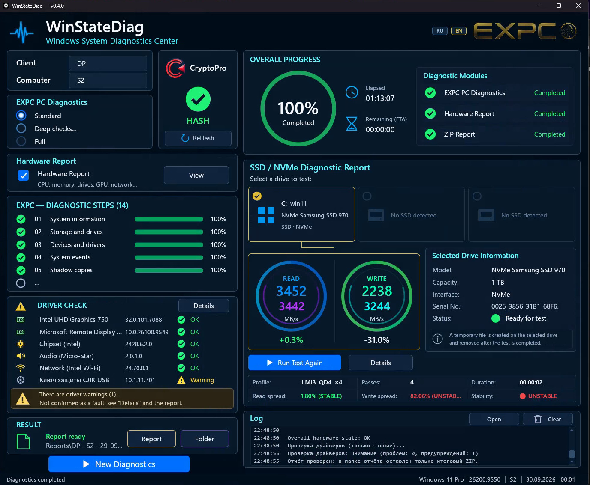

# WinStateDiag

**Portable read-only diagnostic center for Windows**
EN: *Windows System Diagnostics Center* · RU: *Диагностический центр состояния Windows*

Current version: **v0.4.0** · Windows 10 / 11 x64 · portable, no installer

> WinStateDiag **diagnoses and reports**. It does **not** repair Windows and never runs repair commands automatically.

[Русская версия ниже](#русский)

---

## What it does

WinStateDiag is a single portable `WinStateDiag.exe`. It examines the current state of a Windows PC and collects the results into one verified ZIP report per PC and date.

**Diagnostics**
- **EXPC PC Diagnostics** — 14 read-only steps (system, storage, devices, events, VSS, WHEA, shutdowns/BSOD, application errors, memory diagnostic, Defender, deep checks, BIOS/drivers/firmware).
- **Modes:** Standard, Deep checks (choose SFC / DISM / CHKDSK), Full.
- **SFC / DISM / CHKDSK result states** — the completion (100%) is shown separately from what the check found: OK, ATTENTION or ERROR. Example: `DISM ⚠ 100%` means the scan completed and reported a component store that is repairable. The matching repair command is only *shown as text*; WinStateDiag never runs it.
- **Hardware Report** — hardware inventory/passport (system, board, BIOS/UEFI, CPU, RAM, storage, GPU, network, battery).
- **Driver Audit** — read-only check of installed drivers with per-device status and evidence.
- **SSD / NVMe benchmark** — per physical disk (HDDs excluded), up to three disk slots, READ/WRITE results with stability rating and comparison against the previous run of the same disk.
- **CryptoPro** — HASH status check with explicit, user-confirmed ReHash as the only exception to read-only behavior.

**Application**
- RU / EN interface, switchable live.
- Safe Graphics: normal hardware rendering with automatic fallback to a software (WARP) renderer.
- Session journal with a full-journal viewer (save / copy).
- Footer shows the full Windows build (for example `26200.xxxx`).

## Reports

```
WinStateDiag.exe
Reports\
├── <Client> - <Computer> - DD-MM-YY\
│   └── <Client> - <Computer> - DD-MM-YY.zip
└── History\ssd_benchmark_history.log      (persistent SSD history)
```

- One cumulative package per PC and date: every module adds its evidence (TXT / JSON / HTML) to the same ZIP.
- Every ZIP contains **`manifest.json`** (schema 1.0): producer and version, computer, time, Windows build, modules with their evidence files, and SFC / DISM / CHKDSK result states. It is designed to be machine-readable for future tooling; no integration with other tools is implied.
- Each ZIP is written to a temporary file, read back and checked (CRC of every entry) before it replaces the previous one. Only after that verification does the report folder keep just the final ZIP; on any doubt all files are kept.
- The ZIP can be handed to an engineer or an AI assistant for analysis. WinStateDiag itself performs no AI analysis.

## AI-assisted report analysis

When uploading a WinStateDiag ZIP report to ChatGPT, Claude, Gemini or another AI assistant, use the included **[`AI_ANALYSIS_PROMPT.md`](AI_ANALYSIS_PROMPT.md)**.

The prompt asks the AI to inspect the **entire archive**, correlate evidence between files, distinguish current problems from historical/system noise, reference the source evidence for important findings, and avoid unsupported repair recommendations.

## Build from source

Requirements: Rust (stable, edition 2024) with the `x86_64-pc-windows-msvc` toolchain.

```powershell
cargo test
cargo build --release          # static CRT, see .cargo/config.toml
# versioned portable release (fmt/check/test, fresh build, SHA-256 check):
powershell -ExecutionPolicy Bypass -File scripts\make_release.ps1
```

The release script produces `dist\WinStateDiag-vX.Y.Z\WinStateDiag.exe`. The version comes from `Cargo.toml` (title bar, EXE metadata and release folder follow it).

Repository layout: `src\` (Rust GUI and orchestration), `embedded\` (PowerShell diagnostic engine, embedded into the EXE), `assets\` (icon and branding), `scripts\` (release and QA scripts), `docs\` (architecture, known bugs, visual master).

## Known limitations

See [docs/KNOWN_BUGS.md](docs/KNOWN_BUGS.md).

---

## Русский

**WinStateDiag — портативный диагностический центр состояния Windows (только чтение).**
Windows 10 / 11 x64, без установки, один файл `WinStateDiag.exe`.

> WinStateDiag **диагностирует и формирует отчёт**. Он **не** ремонтирует Windows и никогда не запускает команды восстановления автоматически.

**Возможности**
- Диагностика ПК EXPC — 14 этапов; режимы: Основная, Глубокие проверки (выбор SFC / DISM / CHKDSK), Полная.
- Результат SFC / DISM / CHKDSK отдельно от хода выполнения: OK / ВНИМАНИЕ / ОШИБКА. Например, `DISM ⚠ 100%` — проверка завершена, хранилище компонентов требует восстановления. Команда восстановления только показывается текстом и не выполняется.
- Отчёт об оборудовании, проверка драйверов (только чтение).
- Тест SSD / NVMe по физическим дискам с историей и сравнением с предыдущим результатом.
- КриптоПро: проверка HASH; ReHash — только по подтверждению пользователя.
- Интерфейс RU / EN, безопасный запуск графики (резервный программный рендер WARP), журнал сессии.

**Отчёт**: одна накопительная ZIP-папка на компьютер и дату в `Reports\`, внутри — `manifest.json` (машиночитаемое описание модулей, файлов и результатов глубоких проверок). После проверки итогового ZIP в папке отчёта остаётся только он; при любой ошибке все файлы сохраняются.

**Анализ отчёта с помощью ИИ:** при загрузке ZIP в ChatGPT, Claude, Gemini или другой ИИ используйте готовый **[`AI_ANALYSIS_PROMPT.md`](AI_ANALYSIS_PROMPT.md)**. Он задаёт правильный порядок анализа всего архива, сопоставление данных между файлами, отделение актуальных проблем от старых событий и системного шума, а также требует подтверждать существенные выводы конкретными данными отчёта.

## Real screenshots / Реальные скриншоты

Real WinStateDiag v0.4.0 sessions on Windows.





